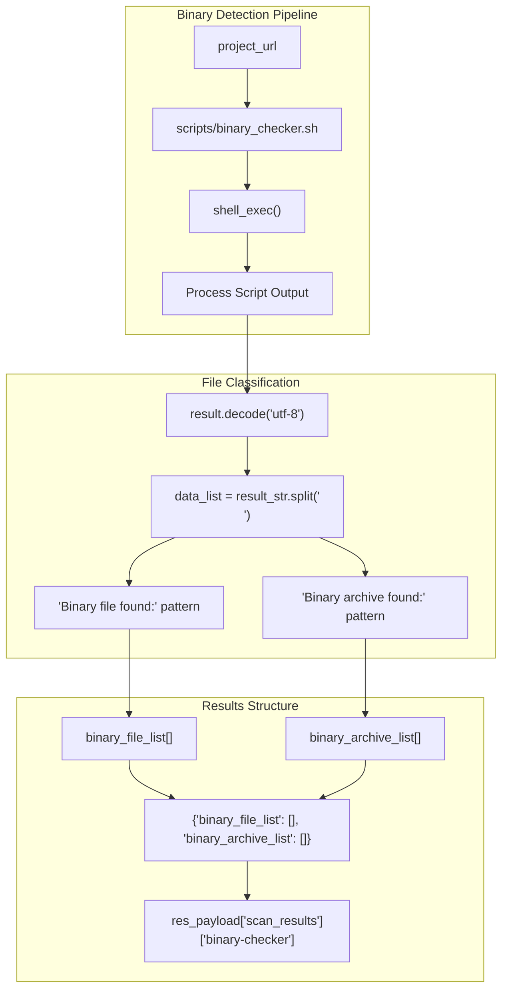
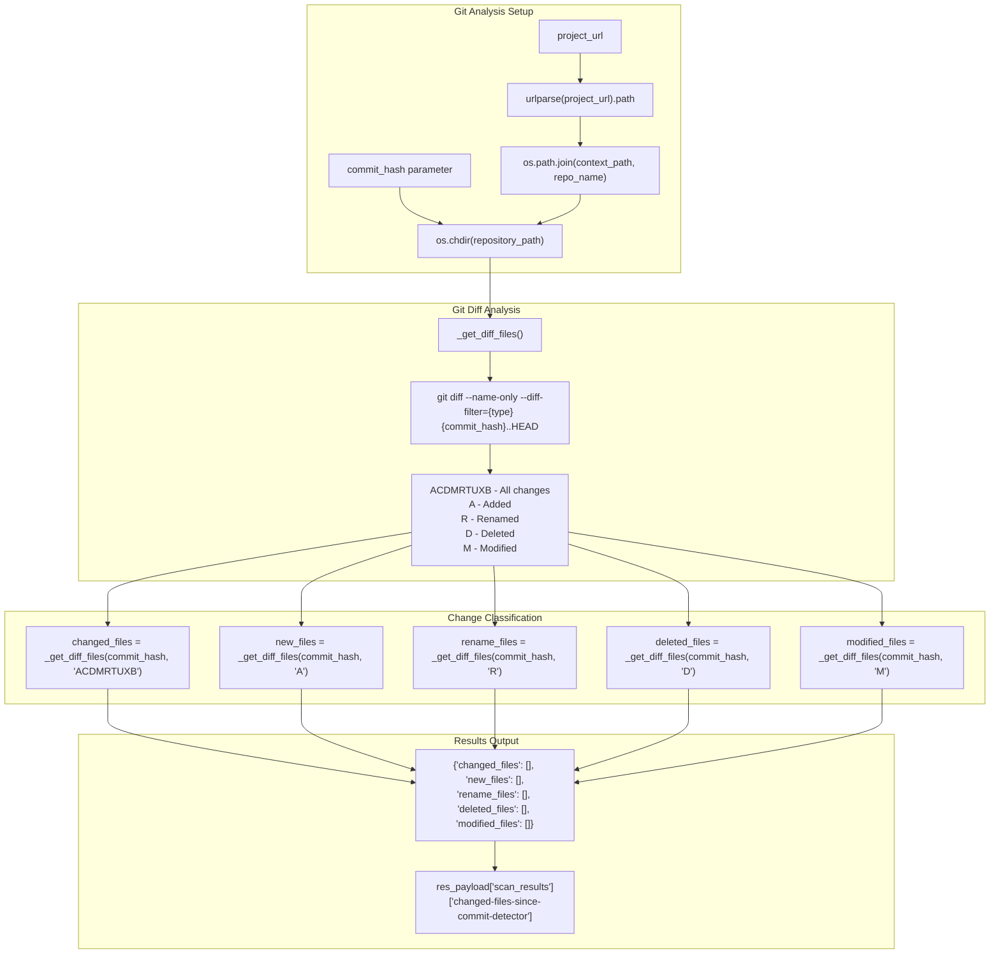
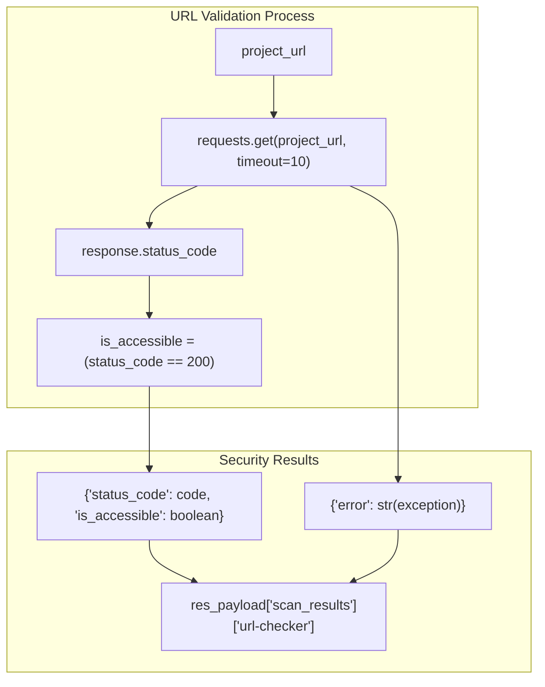
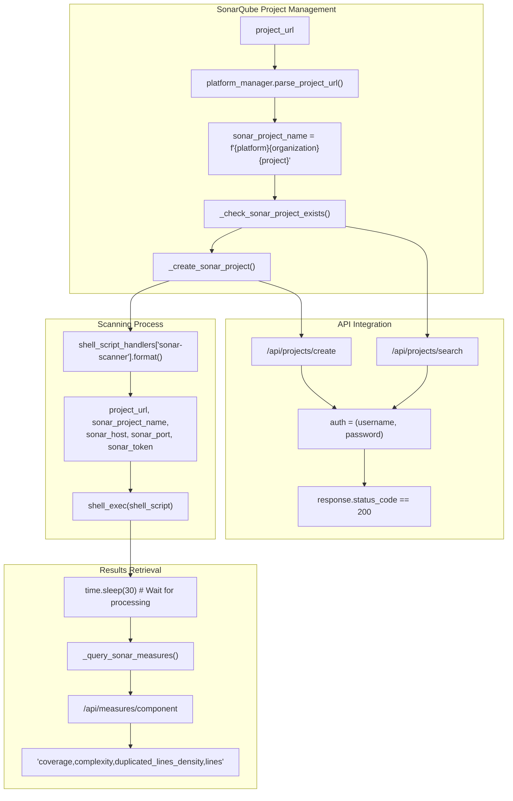
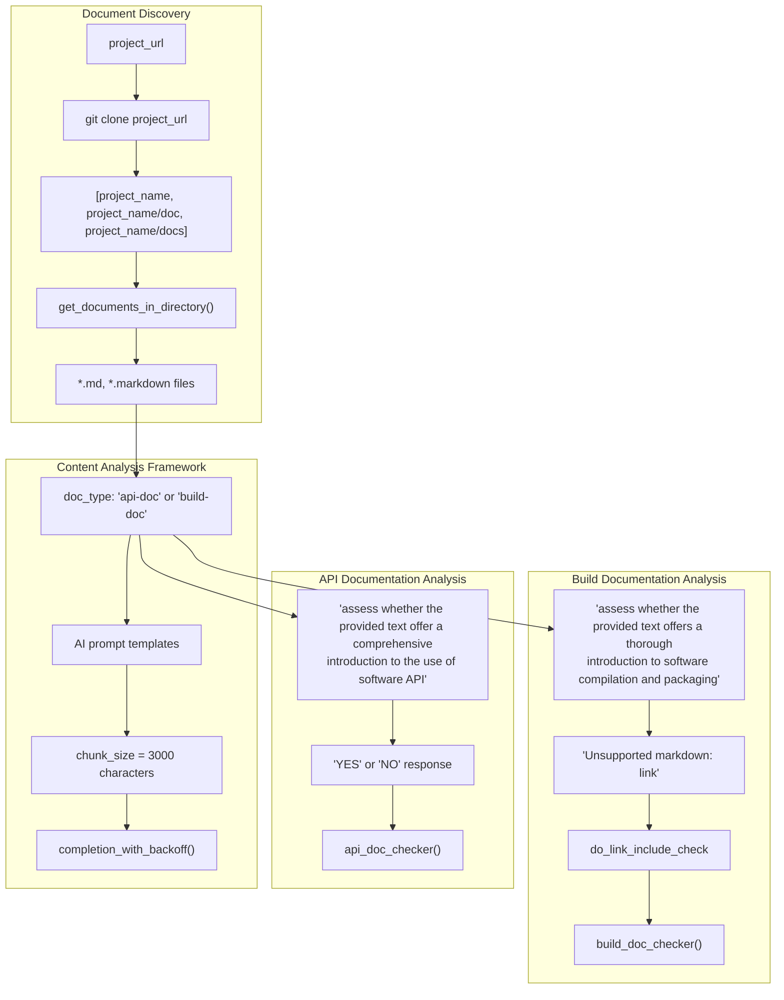
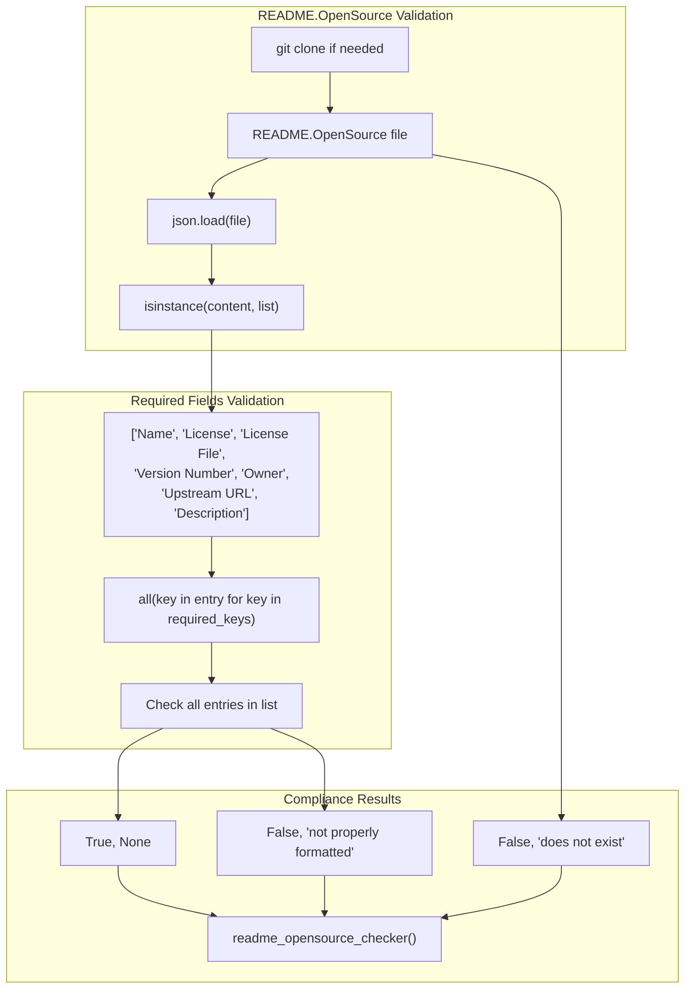
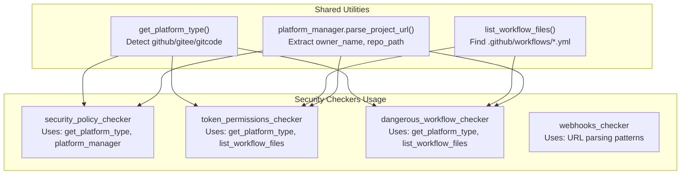

# Security and Compliance Analysis

> **Relevant source files**
> * [openchecker/checkers/binary_checker.py](https://github.com/Laniakea2012/openchecker/blob/1dbd85d0/openchecker/checkers/binary_checker.py)
> * [openchecker/checkers/changed_files_checker.py](https://github.com/Laniakea2012/openchecker/blob/1dbd85d0/openchecker/checkers/changed_files_checker.py)
> * [openchecker/checkers/document_checker.py](https://github.com/Laniakea2012/openchecker/blob/1dbd85d0/openchecker/checkers/document_checker.py)
> * [openchecker/checkers/release_checker.py](https://github.com/Laniakea2012/openchecker/blob/1dbd85d0/openchecker/checkers/release_checker.py)
> * [openchecker/checkers/sonar_checker.py](https://github.com/Laniakea2012/openchecker/blob/1dbd85d0/openchecker/checkers/sonar_checker.py)
> * [openchecker/checkers/url_checker.py](https://github.com/Laniakea2012/openchecker/blob/1dbd85d0/openchecker/checkers/url_checker.py)

This document covers OpenChecker's security and compliance analysis capabilities, which include binary file detection, code quality analysis, document compliance checking, release security validation, and file change monitoring. The security analysis system consists of specialized checkers that examine repositories for potential security risks, compliance violations, and adherence to software development best practices.

For information about SBOM analysis tools, see [4.5](/Laniakea2012/openchecker/4.5-sbom-analysis). For platform-specific integrations that these security checkers depend on, see [5.1](/Laniakea2012/openchecker/5.1-version-control-platform-adapters).

## Security Checker Architecture

The security analysis system consists of six main checkers that examine different aspects of repository security and compliance. All checkers follow a consistent pattern with standardized function signatures and shared utility dependencies.

### Security and Compliance Checker Components

```mermaid
flowchart TD

CommonShell["common.py<br>shell_exec()"]
PlatformMgr["platform_adapter<br>platform_manager"]
Logger["logger<br>get_logger()"]
ExponentialBackoff["exponential_backoff<br>completion_with_backoff()"]
BinaryChecker["binary_checker.py<br>binary_checker()"]
ChangedFiles["changed_files_checker.py<br>changed_files_detector()"]
URLChecker["url_checker.py<br>url_checker()"]
ShellScript["scripts/binary_checker.sh"]
GitDiff["_get_diff_files()"]
SonarChecker["sonar_checker.py<br>sonar_checker()"]
SonarProject["_check_sonar_project_exists()"]
SonarCreate["_create_sonar_project()"]
SonarQuery["_query_sonar_measures()"]
DocumentChecker["document_checker.py<br>check_doc_content()"]
ReadmeChecker["check_readme_opensource()"]
APIDocChecker["api_doc_checker()"]
BuildDocChecker["build_doc_checker()"]
ReadmeOpenSourceChecker["readme_opensource_checker()"]
ReleaseChecker["release_checker.py<br>release_checker()"]
ReleaseContents["check_release_contents()"]
SignedRelease["check_signed_release()"]
GetReleases["get_all_releases_with_assets()"]

BinaryChecker --> CommonShell
ChangedFiles --> Logger
URLChecker --> Logger
SonarChecker --> PlatformMgr
SonarChecker --> CommonShell
DocumentChecker --> ExponentialBackoff
DocumentChecker --> Logger
ReleaseChecker --> PlatformMgr

subgraph subGraph4 ["Release Security"]
    ReleaseChecker
    ReleaseContents
    SignedRelease
    GetReleases
    ReleaseChecker --> ReleaseContents
    ReleaseChecker --> SignedRelease
    ReleaseChecker --> GetReleases
end

subgraph subGraph3 ["Document Compliance"]
    DocumentChecker
    ReadmeChecker
    APIDocChecker
    BuildDocChecker
    ReadmeOpenSourceChecker
    APIDocChecker --> DocumentChecker
    BuildDocChecker --> DocumentChecker
    ReadmeOpenSourceChecker --> ReadmeChecker
end

subgraph subGraph2 ["Code Quality and Security"]
    SonarChecker
    SonarProject
    SonarCreate
    SonarQuery
    SonarChecker --> SonarProject
    SonarChecker --> SonarCreate
    SonarChecker --> SonarQuery
end

subgraph subGraph1 ["File and Binary Security"]
    BinaryChecker
    ChangedFiles
    URLChecker
    ShellScript
    GitDiff
    BinaryChecker --> ShellScript
    ChangedFiles --> GitDiff
end

subgraph subGraph0 ["Core Infrastructure"]
    CommonShell
    PlatformMgr
    Logger
    ExponentialBackoff
end
```

**Sources:** [openchecker/checkers/binary_checker.py L1-L42](https://github.com/Laniakea2012/openchecker/blob/1dbd85d0/openchecker/checkers/binary_checker.py#L1-L42)

 [openchecker/checkers/changed_files_checker.py L1-L77](https://github.com/Laniakea2012/openchecker/blob/1dbd85d0/openchecker/checkers/changed_files_checker.py#L1-L77)

 [openchecker/checkers/url_checker.py L1-L25](https://github.com/Laniakea2012/openchecker/blob/1dbd85d0/openchecker/checkers/url_checker.py#L1-L25)

 [openchecker/checkers/sonar_checker.py L1-L173](https://github.com/Laniakea2012/openchecker/blob/1dbd85d0/openchecker/checkers/sonar_checker.py#L1-L173)

 [openchecker/checkers/document_checker.py L1-L200](https://github.com/Laniakea2012/openchecker/blob/1dbd85d0/openchecker/checkers/document_checker.py#L1-L200)

 [openchecker/checkers/release_checker.py L1-L282](https://github.com/Laniakea2012/openchecker/blob/1dbd85d0/openchecker/checkers/release_checker.py#L1-L282)

## Binary and File Security Analysis

The binary and file security analysis system detects potentially dangerous files and monitors changes that could introduce security risks.

### Binary File Detection

The `binary_checker` identifies binary files and archives that may pose security risks or violate open source compliance requirements.

**Sources:** [openchecker/checkers/binary_checker.py L9-L42](https://github.com/Laniakea2012/openchecker/blob/1dbd85d0/openchecker/checkers/binary_checker.py#L9-L42)

 [openchecker/checkers/binary_checker.py L18-L21](https://github.com/Laniakea2012/openchecker/blob/1dbd85d0/openchecker/checkers/binary_checker.py#L18-L21)

 [openchecker/checkers/binary_checker.py L25-L36](https://github.com/Laniakea2012/openchecker/blob/1dbd85d0/openchecker/checkers/binary_checker.py#L25-L36)

### File Change Security Analysis

The `changed_files_detector` monitors repository changes to identify potentially risky modifications between commits.

**Sources:** [openchecker/checkers/changed_files_checker.py L10-L52](https://github.com/Laniakea2012/openchecker/blob/1dbd85d0/openchecker/checkers/changed_files_checker.py#L10-L52)

 [openchecker/checkers/changed_files_checker.py L54-L77](https://github.com/Laniakea2012/openchecker/blob/1dbd85d0/openchecker/checkers/changed_files_checker.py#L54-L77)

 [openchecker/checkers/changed_files_checker.py L34-L49](https://github.com/Laniakea2012/openchecker/blob/1dbd85d0/openchecker/checkers/changed_files_checker.py#L34-L49)

### URL Security Validation

The `url_checker` validates URL accessibility and security for project links.

**Sources:** [openchecker/checkers/url_checker.py L8-L25](https://github.com/Laniakea2012/openchecker/blob/1dbd85d0/openchecker/checkers/url_checker.py#L8-L25)

 [openchecker/checkers/url_checker.py L16-L21](https://github.com/Laniakea2012/openchecker/blob/1dbd85d0/openchecker/checkers/url_checker.py#L16-L21)

## Code Quality and Security Analysis

### SonarQube Integration

The `sonar_checker` integrates with SonarQube server to perform comprehensive code quality and security analysis.

**Sources:** [openchecker/checkers/sonar_checker.py L14-L62](https://github.com/Laniakea2012/openchecker/blob/1dbd85d0/openchecker/checkers/sonar_checker.py#L14-L62)

 [openchecker/checkers/sonar_checker.py L64-L103](https://github.com/Laniakea2012/openchecker/blob/1dbd85d0/openchecker/checkers/sonar_checker.py#L64-L103)

 [openchecker/checkers/sonar_checker.py L105-L134](https://github.com/Laniakea2012/openchecker/blob/1dbd85d0/openchecker/checkers/sonar_checker.py#L105-L134)

 [openchecker/checkers/sonar_checker.py L136-L173](https://github.com/Laniakea2012/openchecker/blob/1dbd85d0/openchecker/checkers/sonar_checker.py#L136-L173)

## Document and License Compliance

The document compliance system validates project documentation and license information to ensure adherence to open source standards and best practices.

### Document Content Validation

The `document_checker` validates API documentation, build documentation, and license compliance using AI-powered content analysis.

**Sources:** [openchecker/checkers/document_checker.py L11-L95](https://github.com/Laniakea2012/openchecker/blob/1dbd85d0/openchecker/checkers/document_checker.py#L11-L95)

 [openchecker/checkers/document_checker.py L140-L159](https://github.com/Laniakea2012/openchecker/blob/1dbd85d0/openchecker/checkers/document_checker.py#L140-L159)

 [openchecker/checkers/document_checker.py L161-L180](https://github.com/Laniakea2012/openchecker/blob/1dbd85d0/openchecker/checkers/document_checker.py#L161-L180)

### README.OpenSource Compliance

The system validates `README.OpenSource` files for proper JSON structure and required compliance fields.

**Sources:** [openchecker/checkers/document_checker.py L97-L138](https://github.com/Laniakea2012/openchecker/blob/1dbd85d0/openchecker/checkers/document_checker.py#L97-L138)

 [openchecker/checkers/document_checker.py L182-L200](https://github.com/Laniakea2012/openchecker/blob/1dbd85d0/openchecker/checkers/document_checker.py#L182-L200)

 [openchecker/checkers/document_checker.py L118-L132](https://github.com/Laniakea2012/openchecker/blob/1dbd85d0/openchecker/checkers/document_checker.py#L118-L132)

## Integration with Analysis Framework

All security checkers integrate with the broader OpenChecker analysis framework through standardized interfaces and shared utilities.

### Common Integration Patterns

| Component | Purpose | Usage |
| --- | --- | --- |
| `COMMAND` constant | Unique identifier for each checker | Used as key in `scan_results` |
| `project_url` parameter | Repository URL to analyze | Parsed by `platform_manager` |
| `res_payload` parameter | Shared results container | Updated with `scan_results[COMMAND]` |
| `access_token` parameter | Optional authentication | Required for webhook analysis |

The security checkers leverage shared utilities from the platform adapter system:

**Sources:** [openchecker/checkers/security_policy_checker.py L5-L6](https://github.com/Laniakea2012/openchecker/blob/1dbd85d0/openchecker/checkers/security_policy_checker.py#L5-L6)

 [openchecker/checkers/token_permissions_checker.py L8-L9](https://github.com/Laniakea2012/openchecker/blob/1dbd85d0/openchecker/checkers/token_permissions_checker.py#L8-L9)

 [openchecker/checkers/dangerous_workflow_checker.py L5-L6](https://github.com/Laniakea2012/openchecker/blob/1dbd85d0/openchecker/checkers/dangerous_workflow_checker.py#L5-L6)

 [openchecker/checkers/webhooks_checker.py L15-L16](https://github.com/Laniakea2012/openchecker/blob/1dbd85d0/openchecker/checkers/webhooks_checker.py#L15-L16)