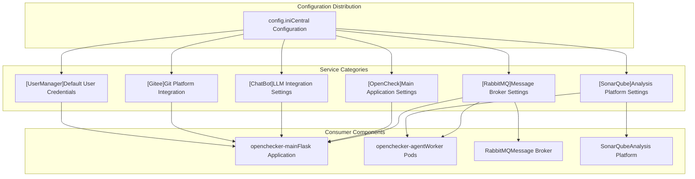
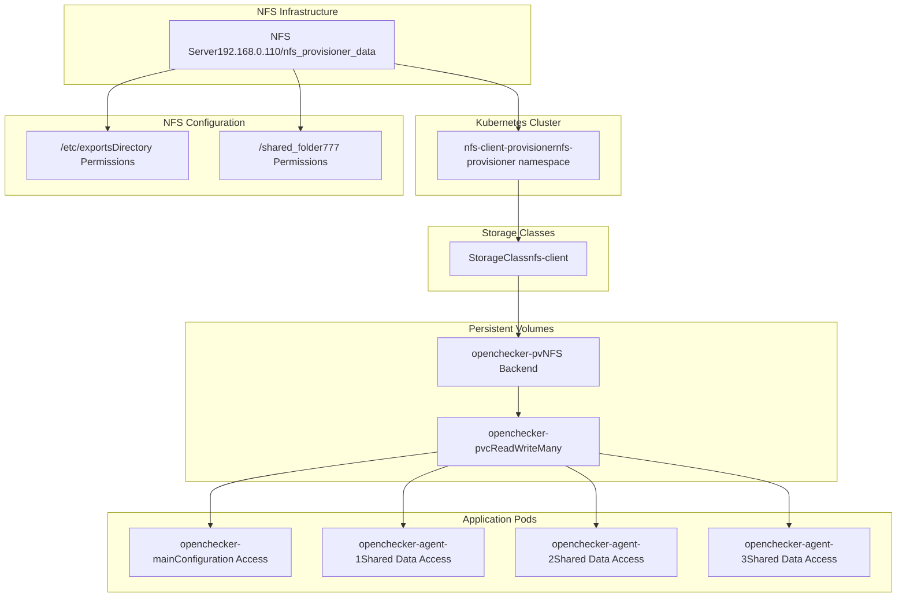
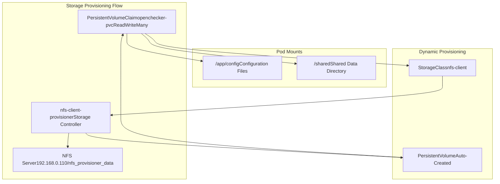
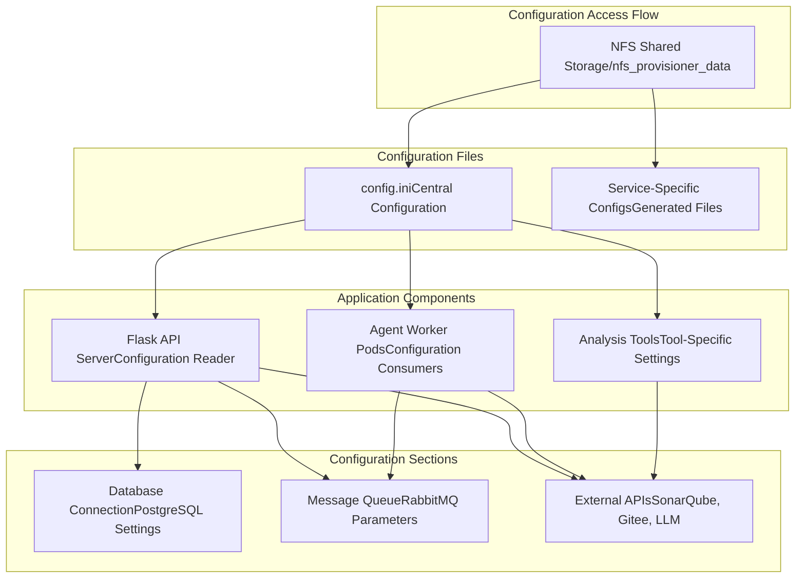

# Storage and Configuration Management

> **Relevant source files**
> * [config/config.ini](https://github.com/Laniakea2012/openchecker/blob/00a9732e/config/config.ini)
> * [kubernetes/nfs-client-provisioner/kustomization.yaml](https://github.com/Laniakea2012/openchecker/blob/00a9732e/kubernetes/nfs-client-provisioner/kustomization.yaml)
> * [kubernetes/nfs-client-provisioner/namespace.yaml](https://github.com/Laniakea2012/openchecker/blob/00a9732e/kubernetes/nfs-client-provisioner/namespace.yaml)
> * [kubernetes/nfs-client-provisioner/notes.md](https://github.com/Laniakea2012/openchecker/blob/00a9732e/kubernetes/nfs-client-provisioner/notes.md)
> * [kubernetes/nfs-client-provisioner/patch_nfs_details.yaml](https://github.com/Laniakea2012/openchecker/blob/00a9732e/kubernetes/nfs-client-provisioner/patch_nfs_details.yaml)

This document covers the centralized configuration management and shared storage infrastructure for the OpenChecker system. It explains how configuration parameters are managed through the `config.ini` file and how NFS-based shared storage is provisioned and integrated into the Kubernetes deployment.

For information about the Kubernetes deployment manifests and services, see [Kubernetes Deployments](/Laniakea2012/openchecker/6.1-kubernetes-deployments) and [Supporting Services](/Laniakea2012/openchecker/6.2-supporting-services).

## Configuration Management

OpenChecker uses a centralized configuration file approach to manage settings across all system components. The primary configuration is maintained in `config.ini`, which contains connection parameters for external services and application-specific settings.

### Configuration Structure

The configuration file is organized into logical sections for different service categories:

| Section | Purpose | Key Parameters |
| --- | --- | --- |
| `[RabbitMQ]` | Message broker connection | host, port, username, password, heartbeat settings |
| `[SonarQube]` | Static analysis platform | host, port, authentication credentials |
| `[OpenCheck]` | Main application settings | bind address, port, SSL certificate paths |
| `[ChatBot]` | LLM integration | API endpoint, authentication, model configuration |
| `[Gitee]` | Git platform integration | access token for API operations |
| `[UserManager]` | Default user credentials | initial admin account setup |

**Sources:** [config/config.ini L1-L33](https://github.com/Laniakea2012/openchecker/blob/00a9732e/config/config.ini#L1-L33)

### Configuration Parameters

The configuration file defines connection parameters and service endpoints using a standard INI format. Key configuration sections include:

**RabbitMQ Configuration** - Defines message broker connectivity with connection timeouts and heartbeat settings [config/config.ini L1-L7](https://github.com/Laniakea2012/openchecker/blob/00a9732e/config/config.ini#L1-L7)

**SonarQube Integration** - Specifies the static analysis platform endpoint and authentication credentials [config/config.ini L9-L14](https://github.com/Laniakea2012/openchecker/blob/00a9732e/config/config.ini#L9-L14)

**Application Binding** - Sets the main application listen address, port, and SSL certificate locations [config/config.ini L16-L20](https://github.com/Laniakea2012/openchecker/blob/00a9732e/config/config.ini#L16-L20)

**External Service Integration** - Provides API endpoints and authentication tokens for ChatBot LLM services and Gitee platform integration [config/config.ini L22-L28](https://github.com/Laniakea2012/openchecker/blob/00a9732e/config/config.ini#L22-L28)

**User Management** - Defines default administrative user credentials for initial system setup [config/config.ini L30-L32](https://github.com/Laniakea2012/openchecker/blob/00a9732e/config/config.ini#L30-L32)

## NFS Storage Architecture

OpenChecker implements a shared storage system using Network File System (NFS) to provide consistent data access across all Kubernetes pods. This enables configuration sharing, persistent data storage, and coordination between the main application and agent workers.

### NFS Server Setup

The NFS infrastructure consists of a dedicated NFS server that provides shared storage to the Kubernetes cluster:

**Sources:** [kubernetes/nfs-client-provisioner/patch_nfs_details.yaml L14-L22](https://github.com/Laniakea2012/openchecker/blob/00a9732e/kubernetes/nfs-client-provisioner/patch_nfs_details.yaml#L14-L22)

 [kubernetes/nfs-client-provisioner/notes.md L1-L48](https://github.com/Laniakea2012/openchecker/blob/00a9732e/kubernetes/nfs-client-provisioner/notes.md#L1-L48)

### NFS Client Provisioner

The Kubernetes cluster uses the `nfs-subdir-external-provisioner` to dynamically provision storage volumes backed by the NFS server. The provisioner is deployed in a dedicated namespace with specific NFS server connection parameters.

**Provisioner Configuration** - The NFS client provisioner connects to server `192.168.0.110` with the export path `/nfs_provisioner_data` [kubernetes/nfs-client-provisioner/patch_nfs_details.yaml L14-L17](https://github.com/Laniakea2012/openchecker/blob/00a9732e/kubernetes/nfs-client-provisioner/patch_nfs_details.yaml#L14-L17)

**Namespace Isolation** - The provisioner runs in the `nfs-provisioner` namespace to separate infrastructure components from application workloads [kubernetes/nfs-client-provisioner/namespace.yaml

4](https://github.com/Laniakea2012/openchecker/blob/00a9732e/kubernetes/nfs-client-provisioner/namespace.yaml#L4-L4)

**Kustomization Setup** - The deployment uses Kustomize to apply patches for NFS server details while leveraging the upstream provisioner configuration [kubernetes/nfs-client-provisioner/kustomization.yaml L1-L7](https://github.com/Laniakea2012/openchecker/blob/00a9732e/kubernetes/nfs-client-provisioner/kustomization.yaml#L1-L7)

## Storage Integration with Kubernetes

The shared storage system integrates with the OpenChecker Kubernetes deployment to provide consistent data access across all application components.

### Volume Provisioning

**Sources:** [kubernetes/nfs-client-provisioner/patch_nfs_details.yaml L18-L22](https://github.com/Laniakea2012/openchecker/blob/00a9732e/kubernetes/nfs-client-provisioner/patch_nfs_details.yaml#L18-L22)

### Multi-Pod Access Pattern

The NFS storage system supports the `ReadWriteMany` access mode, enabling multiple pods to simultaneously read and write to shared volumes. This is essential for OpenChecker's distributed architecture where the main API and multiple agent workers need coordinated access to configuration files and shared data.

**Configuration Sharing** - All pods mount the same configuration directory to access the centralized `config.ini` file

**Data Coordination** - Agent workers use shared storage for coordinating analysis results and temporary file storage

**Persistent State** - The shared storage preserves data across pod restarts and scaling operations

## Configuration Distribution

The configuration management system ensures that all application components have access to current configuration parameters through the shared NFS storage.

### Access Patterns

**Sources:** [config/config.ini L1-L33](https://github.com/Laniakea2012/openchecker/blob/00a9732e/config/config.ini#L1-L33)

### Runtime Configuration Updates

The shared storage system enables runtime configuration updates without requiring pod restarts. Applications can monitor the configuration file for changes and reload parameters as needed, supporting operational flexibility in the distributed system.