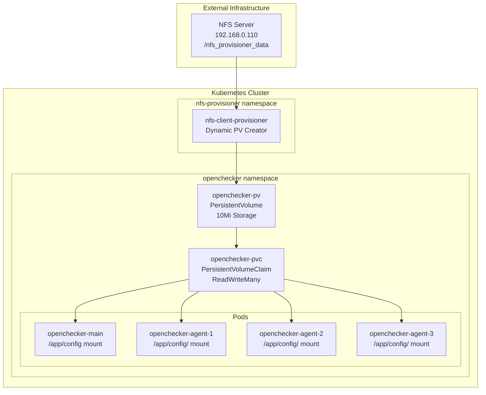
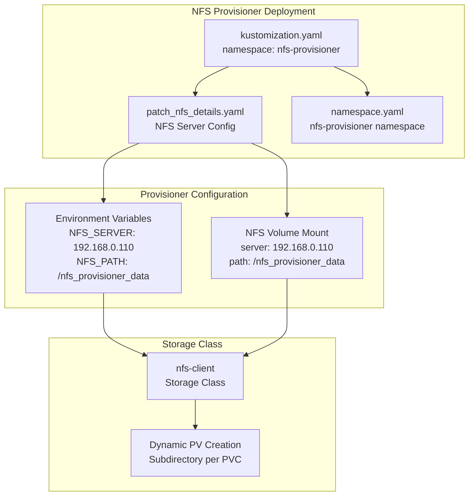
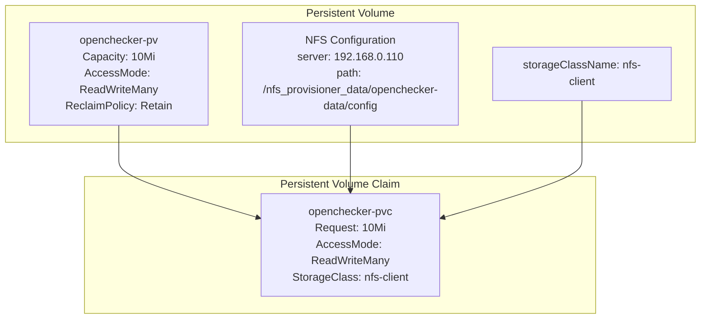
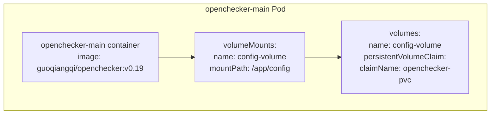
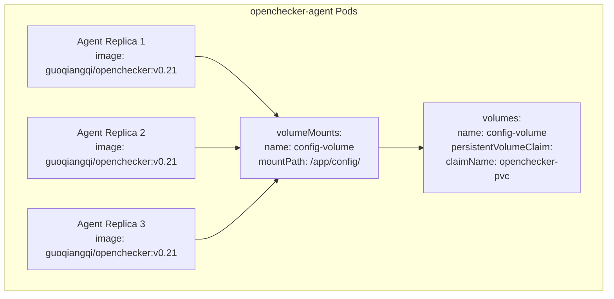

# Storage and NFS Provisioning

> **Relevant source files**
> * [kubernetes/nfs-client-provisioner/kustomization.yaml](https://github.com/Laniakea2012/openchecker/blob/1dbd85d0/kubernetes/nfs-client-provisioner/kustomization.yaml)
> * [kubernetes/nfs-client-provisioner/namespace.yaml](https://github.com/Laniakea2012/openchecker/blob/1dbd85d0/kubernetes/nfs-client-provisioner/namespace.yaml)
> * [kubernetes/nfs-client-provisioner/notes.md](https://github.com/Laniakea2012/openchecker/blob/1dbd85d0/kubernetes/nfs-client-provisioner/notes.md)
> * [kubernetes/nfs-client-provisioner/patch_nfs_details.yaml](https://github.com/Laniakea2012/openchecker/blob/1dbd85d0/kubernetes/nfs-client-provisioner/patch_nfs_details.yaml)
> * [kubernetes/postgresql/configmap.yaml](https://github.com/Laniakea2012/openchecker/blob/1dbd85d0/kubernetes/postgresql/configmap.yaml)
> * [kubernetes/postgresql/deployment.yaml](https://github.com/Laniakea2012/openchecker/blob/1dbd85d0/kubernetes/postgresql/deployment.yaml)
> * [kubernetes/postgresql/service.yaml](https://github.com/Laniakea2012/openchecker/blob/1dbd85d0/kubernetes/postgresql/service.yaml)
> * [kubernetes/postgresql/volumes.yaml](https://github.com/Laniakea2012/openchecker/blob/1dbd85d0/kubernetes/postgresql/volumes.yaml)

This document covers the Network File System (NFS) storage configuration and dynamic volume provisioning setup for the OpenChecker platform. The storage system provides shared configuration access across all pods and enables persistent data storage using NFS-backed Kubernetes volumes.

For general Kubernetes deployment configuration, see [Kubernetes Deployment](/Laniakea2012/openchecker/7.2-kubernetes-deployment). For logging and monitoring infrastructure, see [Logging and Monitoring](/Laniakea2012/openchecker/7.4-logging-and-monitoring).

## Storage Architecture Overview

OpenChecker uses NFS-based storage to provide shared access to configuration files across all pods in the cluster. The storage architecture consists of an external NFS server, a Kubernetes NFS provisioner, and persistent volumes that are mounted by both the main API server and agent pods.

**NFS Storage Architecture**

Sources: [kubernetes/openchecker-main/volumes.yaml L1-L31](https://github.com/Laniakea2012/openchecker/blob/1dbd85d0/kubernetes/openchecker-main/volumes.yaml#L1-L31)

 [kubernetes/nfs-client-provisioner/patch_nfs_details.yaml L1-L22](https://github.com/Laniakea2012/openchecker/blob/1dbd85d0/kubernetes/nfs-client-provisioner/patch_nfs_details.yaml#L1-L22)

## NFS Server Configuration

The OpenChecker deployment relies on an external NFS server running at `192.168.0.110` with the shared directory `/nfs_provisioner_data`. The NFS server must be configured with appropriate permissions and export settings before deploying the Kubernetes components.

### Server Setup Requirements

| Component | Value | Purpose |
| --- | --- | --- |
| Server IP | 192.168.0.110 | NFS server address |
| Export Path | /nfs_provisioner_data | Root directory for all provisioned volumes |
| Config Path | /nfs_provisioner_data/openchecker-data/config | Specific path for OpenChecker configuration |
| Permissions | 77x recursive | Allow read/write access for containers |

The NFS server setup involves installing `nfs-kernel-server` and `nfs-common` packages, creating the shared directory with appropriate permissions, and configuring the `/etc/exports` file to allow client access.

Sources: [kubernetes/nfs-client-provisioner/notes.md L1-L48](https://github.com/Laniakea2012/openchecker/blob/1dbd85d0/kubernetes/nfs-client-provisioner/notes.md#L1-L48)

 [kubernetes/openchecker-main/volumes.yaml L14-L16](https://github.com/Laniakea2012/openchecker/blob/1dbd85d0/kubernetes/openchecker-main/volumes.yaml#L14-L16)

## Dynamic Volume Provisioning

OpenChecker uses the `nfs-subdir-external-provisioner` to enable dynamic creation of persistent volumes on the NFS server. The provisioner is deployed in the `nfs-provisioner` namespace and automatically creates subdirectories on the NFS server for each persistent volume claim.

**NFS Provisioner Components**

The provisioner configuration uses Kustomize to patch the base deployment with OpenChecker-specific NFS server details. The `patch_nfs_details.yaml` file sets the `NFS_SERVER` and `NFS_PATH` environment variables and configures the NFS volume mount.

Sources: [kubernetes/nfs-client-provisioner/kustomization.yaml L1-L7](https://github.com/Laniakea2012/openchecker/blob/1dbd85d0/kubernetes/nfs-client-provisioner/kustomization.yaml#L1-L7)

 [kubernetes/nfs-client-provisioner/patch_nfs_details.yaml L1-L22](https://github.com/Laniakea2012/openchecker/blob/1dbd85d0/kubernetes/nfs-client-provisioner/patch_nfs_details.yaml#L1-L22)

 [kubernetes/nfs-client-provisioner/namespace.yaml L1-L4](https://github.com/Laniakea2012/openchecker/blob/1dbd85d0/kubernetes/nfs-client-provisioner/namespace.yaml#L1-L4)

## Persistent Volume Claims

The OpenChecker system uses a single persistent volume claim named `openchecker-pvc` that is shared across all pods. This PVC is backed by a manually created persistent volume `openchecker-pv` configured specifically for configuration file storage.

### Volume Configuration

**Persistent Volume and Claim Configuration**

The persistent volume is configured with `ReadWriteMany` access mode, allowing multiple pods to mount the same volume simultaneously. The `Retain` reclaim policy ensures that data persists even if the PVC is deleted.

| Setting | Value | Purpose |
| --- | --- | --- |
| `capacity.storage` | 10Mi | Small size appropriate for configuration files |
| `accessModes` | ReadWriteMany | Multiple pods can mount simultaneously |
| `persistentVolumeReclaimPolicy` | Retain | Data persists after PVC deletion |
| `storageClassName` | nfs-client | Uses NFS provisioner |

Sources: [kubernetes/openchecker-main/volumes.yaml L1-L31](https://github.com/Laniakea2012/openchecker/blob/1dbd85d0/kubernetes/openchecker-main/volumes.yaml#L1-L31)

## Volume Mounting in Deployments

Both the `openchecker-main` and `openchecker-agent` deployments mount the same persistent volume claim to provide shared access to configuration files. The volume is mounted as `config-volume` in both deployments but with slightly different mount paths.

### Main Deployment Volume Mount

The main API server deployment mounts the configuration volume at `/app/config`:

**Main Deployment Volume Configuration**

### Agent Deployment Volume Mount

The agent deployment uses the same PVC but mounts it at `/app/config/` (with trailing slash) across all 3 replicas:

**Agent Deployment Volume Configuration**

Sources: [kubernetes/openchecker-main/deployment.yaml L26-L32](https://github.com/Laniakea2012/openchecker/blob/1dbd85d0/kubernetes/openchecker-main/deployment.yaml#L26-L32)

 [kubernetes/openchecker-agent/deployment.yaml L24-L30](https://github.com/Laniakea2012/openchecker/blob/1dbd85d0/kubernetes/openchecker-agent/deployment.yaml#L24-L30)

## Storage Requirements and Sizing

The current storage configuration allocates 10Mi for configuration files, which is appropriate for the system's configuration file requirements. The small storage size reflects the primary use case of storing configuration files rather than application data or logs.

### Capacity Planning

| Component | Current Size | Access Pattern | Scaling Considerations |
| --- | --- | --- | --- |
| Configuration Files | 10Mi | Read-heavy, infrequent writes | Size adequate for config files |
| Access Mode | ReadWriteMany | Multiple concurrent readers | Required for multi-pod access |
| Performance | NFS network storage | Config access at startup | Network latency acceptable for config |

The `ReadWriteMany` access mode is essential for the OpenChecker architecture since both the main API server and multiple agent replicas need simultaneous access to the same configuration files. The NFS-based storage provides the necessary shared file system semantics for this use case.

Sources: [kubernetes/openchecker-main/volumes.yaml L8-L11](https://github.com/Laniakea2012/openchecker/blob/1dbd85d0/kubernetes/openchecker-main/volumes.yaml#L8-L11)

 [kubernetes/openchecker-main/volumes.yaml L26-L31](https://github.com/Laniakea2012/openchecker/blob/1dbd85d0/kubernetes/openchecker-main/volumes.yaml#L26-L31)