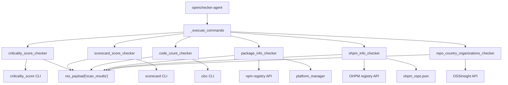
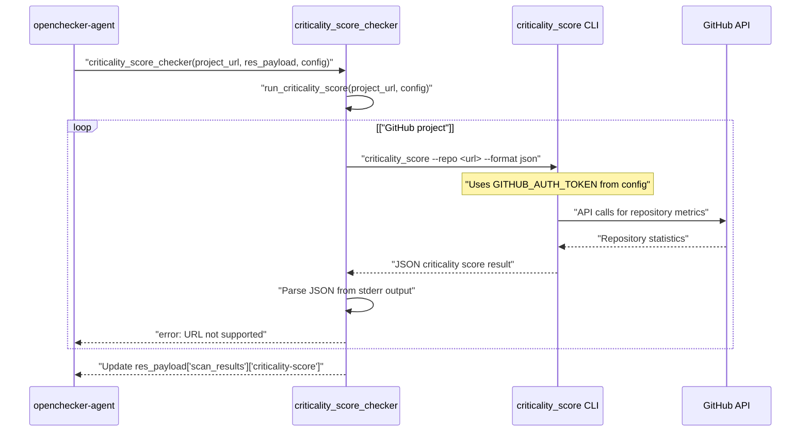
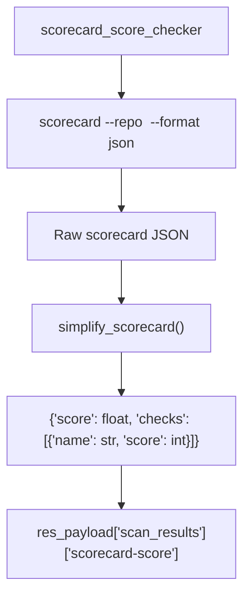
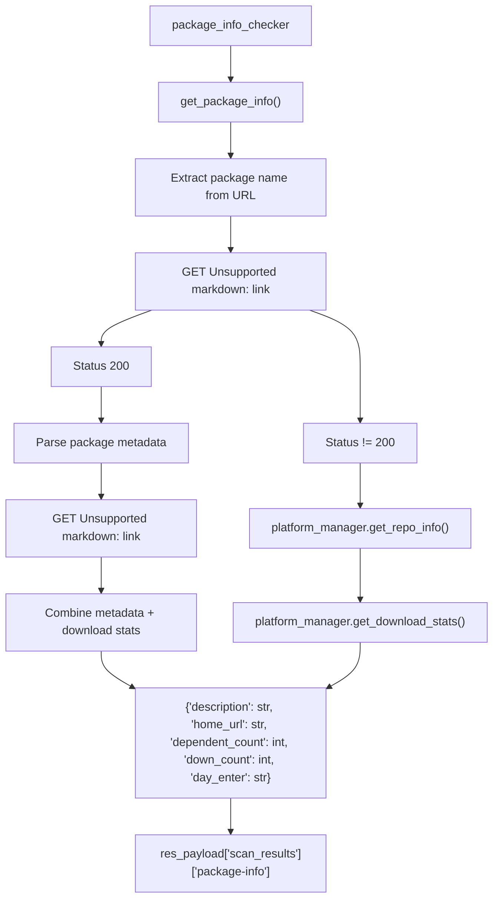
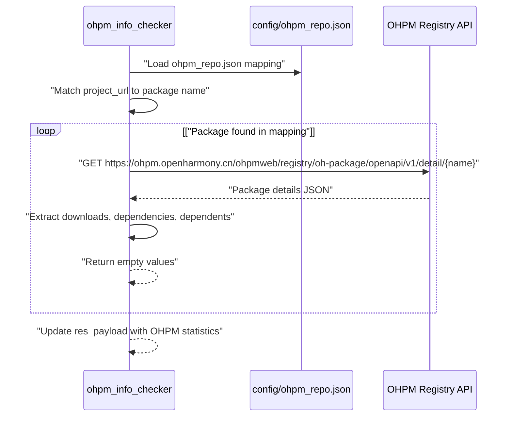
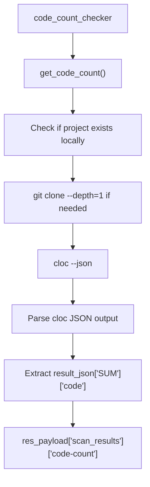
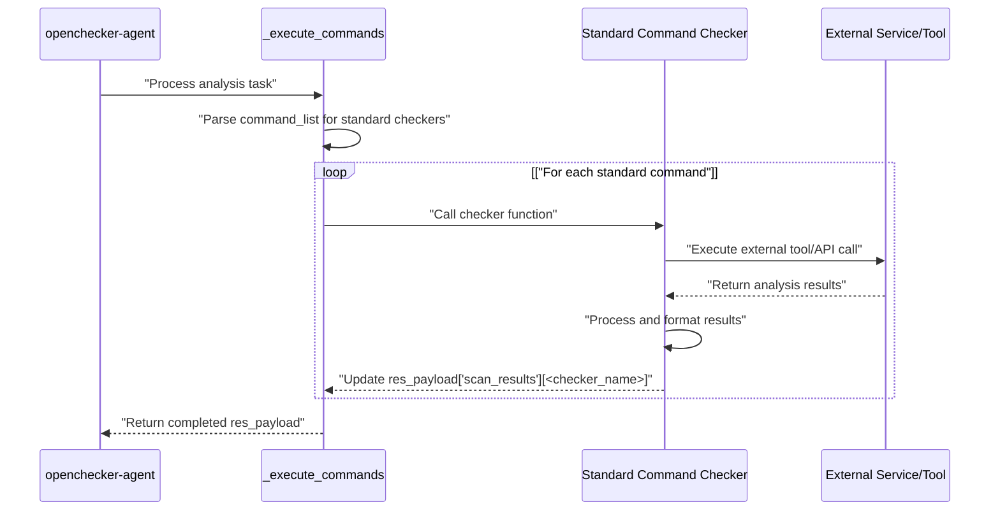

# Supply Chain and Quality Analysis

> **Relevant source files**
> * [openchecker/checkers/standard_command_checker.py](https://github.com/Laniakea2012/openchecker/blob/1dbd85d0/openchecker/checkers/standard_command_checker.py)
> * [openchecker/criticality/run.py](https://github.com/Laniakea2012/openchecker/blob/1dbd85d0/openchecker/criticality/run.py)

This document covers the standard command checkers that analyze software supply chain health, quality metrics, and community characteristics. These checkers evaluate project criticality, package ecosystem data, code statistics, and contributor demographics to provide comprehensive supply chain risk assessment.

For security-focused analysis including dangerous workflows and webhook security, see [Security and Compliance Analysis](/Laniakea2012/openchecker/4.3-security-and-compliance-analysis). For Software Bill of Materials (SBOM) detection and analysis, see [SBOM Analysis](/Laniakea2012/openchecker/4.5-sbom-analysis).

## Overview

The supply chain and quality analysis system consists of multiple specialized checkers that evaluate different aspects of software projects:

Sources: [openchecker/checkers/standard_command_checker.py L300-L440](https://github.com/Laniakea2012/openchecker/blob/1dbd85d0/openchecker/checkers/standard_command_checker.py#L300-L440)

## Criticality Score Analysis

The criticality score assessment evaluates project importance based on multiple metrics including community activity, dependency usage, and maintenance indicators.

### Criticality Score Checker

The `criticality_score_checker` function integrates with the Google OSS criticality score tool to assess project importance:

The criticality score calculation considers multiple repository metrics:

| Metric | Weight | Description |
| --- | --- | --- |
| `created_since` | Time-based | Months since repository creation |
| `updated_since` | Time-based | Months since last commit |
| `contributor_count` | Community | Number of unique contributors |
| `org_count` | Diversity | Number of different organizations |
| `commit_frequency` | Activity | Average commits per week |
| `recent_releases_count` | Maintenance | Recent releases in lookback period |
| `updated_issues_count` | Engagement | Issues updated recently |
| `closed_issues_count` | Responsiveness | Issues closed recently |
| `comment_frequency` | Communication | Average comments per issue |
| `dependents_count` | Usage | Number of dependent projects |

Sources: [openchecker/checkers/standard_command_checker.py L13-L49](https://github.com/Laniakea2012/openchecker/blob/1dbd85d0/openchecker/checkers/standard_command_checker.py#L13-L49)

 [openchecker/criticality/run.py L51-L55](https://github.com/Laniakea2012/openchecker/blob/1dbd85d0/openchecker/criticality/run.py#L51-L55)

 [openchecker/criticality/run.py L479-L532](https://github.com/Laniakea2012/openchecker/blob/1dbd85d0/openchecker/criticality/run.py#L479-L532)

### Scorecard Integration

The `scorecard_score_checker` leverages the OSSF Scorecard project to evaluate security and maintenance practices:

The scorecard results are simplified to include only essential metrics, filtering out detailed documentation and focusing on scores for each security check.

Sources: [openchecker/checkers/standard_command_checker.py L51-L101](https://github.com/Laniakea2012/openchecker/blob/1dbd85d0/openchecker/checkers/standard_command_checker.py#L51-L101)

 [openchecker/checkers/standard_command_checker.py L318-L332](https://github.com/Laniakea2012/openchecker/blob/1dbd85d0/openchecker/checkers/standard_command_checker.py#L318-L332)

## Package and Registry Analysis

The system analyzes package ecosystem data from multiple registry sources to assess supply chain characteristics.

### NPM Package Analysis

The `package_info_checker` retrieves comprehensive package metadata from the npm registry:

Sources: [openchecker/checkers/standard_command_checker.py L130-L196](https://github.com/Laniakea2012/openchecker/blob/1dbd85d0/openchecker/checkers/standard_command_checker.py#L130-L196)

 [openchecker/checkers/standard_command_checker.py L352-L366](https://github.com/Laniakea2012/openchecker/blob/1dbd85d0/openchecker/checkers/standard_command_checker.py#L352-L366)

### OHPM Package Analysis

For OpenHarmony projects, the `ohpm_info_checker` analyzes OHPM registry data:

The OHPM analysis extracts three key metrics:

* `down_count`: Total download count
* `dependent`: Number of packages this package depends on
* `bedependent`: Number of packages that depend on this package

Sources: [openchecker/checkers/standard_command_checker.py L198-L232](https://github.com/Laniakea2012/openchecker/blob/1dbd85d0/openchecker/checkers/standard_command_checker.py#L198-L232)

 [openchecker/checkers/standard_command_checker.py L369-L383](https://github.com/Laniakea2012/openchecker/blob/1dbd85d0/openchecker/checkers/standard_command_checker.py#L369-L383)

## Code Quality Metrics

### Code Count Analysis

The `code_count_checker` uses the `cloc` tool to analyze codebase size and composition:

The code count analysis provides the total lines of code across all files in the repository, giving an indication of project size and complexity.

Sources: [openchecker/checkers/standard_command_checker.py L104-L127](https://github.com/Laniakea2012/openchecker/blob/1dbd85d0/openchecker/checkers/standard_command_checker.py#L104-L127)

 [openchecker/checkers/standard_command_checker.py L335-L349](https://github.com/Laniakea2012/openchecker/blob/1dbd85d0/openchecker/checkers/standard_command_checker.py#L335-L349)

## Community and Geographic Analysis

The system analyzes contributor demographics and geographic distribution using the OSSInsight API.

### Geographic and Organizational Distribution

The `repo_country_organizations_checker` collects comprehensive community analysis data:

```mermaid
flowchart TD

CommunityChecker["repo_country_organizations_checker"]
IssueCountries["get_type_countries(url, 'issue_creators')"]
IssueOrgs["get_type_organizations(url, 'issue_creators')"]
PRCountries["get_type_countries(url, 'pull_request_creators')"]
PROrgs["get_type_organizations(url, 'pull_request_creators')"]
StarCountries["get_type_countries(url, 'stargazers')"]
StarOrgs["get_type_organizations(url, 'stargazers')"]
OSSInsightAPI1["api.ossinsight.io/v1/repos/{owner}/{repo}/issue_creators/countries/"]
OSSInsightAPI2["api.ossinsight.io/v1/repos/{owner}/{repo}/issue_creators/organizations/"]
OSSInsightAPI3["api.ossinsight.io/v1/repos/{owner}/{repo}/pull_request_creators/countries/"]
OSSInsightAPI4["api.ossinsight.io/v1/repos/{owner}/{repo}/pull_request_creators/organizations/"]
OSSInsightAPI5["api.ossinsight.io/v1/repos/{owner}/{repo}/stargazers/countries/"]
OSSInsightAPI6["api.ossinsight.io/v1/repos/{owner}/{repo}/stargazers/organizations/"]
Results["Multiple result fields in res_payload"]

CommunityChecker --> IssueCountries
CommunityChecker --> IssueOrgs
CommunityChecker --> PRCountries
CommunityChecker --> PROrgs
CommunityChecker --> StarCountries
CommunityChecker --> StarOrgs
IssueCountries --> OSSInsightAPI1
IssueOrgs --> OSSInsightAPI2
PRCountries --> OSSInsightAPI3
PROrgs --> OSSInsightAPI4
StarCountries --> OSSInsightAPI5
StarOrgs --> OSSInsightAPI6
OSSInsightAPI1 --> Results
OSSInsightAPI2 --> Results
OSSInsightAPI3 --> Results
OSSInsightAPI4 --> Results
OSSInsightAPI5 --> Results
OSSInsightAPI6 --> Results
```

The community analysis generates six distinct result fields:

* `issue_creators_country`: Geographic distribution of issue creators
* `issue_creators_organizations`: Organizational distribution of issue creators
* `pull_request_creators_country`: Geographic distribution of PR creators
* `pull_request_creators_organizations`: Organizational distribution of PR creators
* `stargazers_country`: Geographic distribution of stargazers
* `stargazers_organizations`: Organizational distribution of stargazers

Sources: [openchecker/checkers/standard_command_checker.py L234-L296](https://github.com/Laniakea2012/openchecker/blob/1dbd85d0/openchecker/checkers/standard_command_checker.py#L234-L296)

 [openchecker/checkers/standard_command_checker.py L386-L439](https://github.com/Laniakea2012/openchecker/blob/1dbd85d0/openchecker/checkers/standard_command_checker.py#L386-L439)

## Integration with Analysis Workflow

These checkers integrate into the broader OpenChecker analysis pipeline through the command execution framework:

Each checker follows a consistent pattern:

1. Receives `project_url`, `res_payload`, and optional `config` parameters
2. Executes analysis using external tools or API calls
3. Processes results into standardized format
4. Updates the `res_payload['scan_results']` dictionary with results or error information
5. Logs success or failure messages

Sources: [openchecker/checkers/standard_command_checker.py L300-L440](https://github.com/Laniakea2012/openchecker/blob/1dbd85d0/openchecker/checkers/standard_command_checker.py#L300-L440)