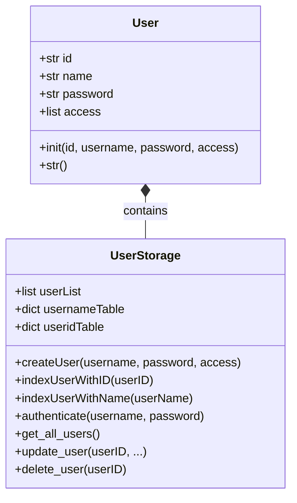
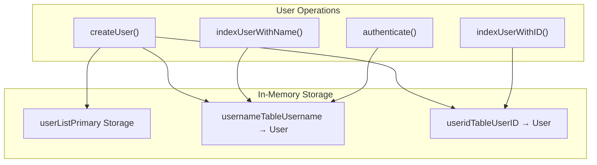
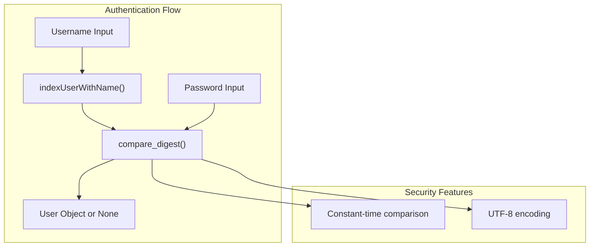
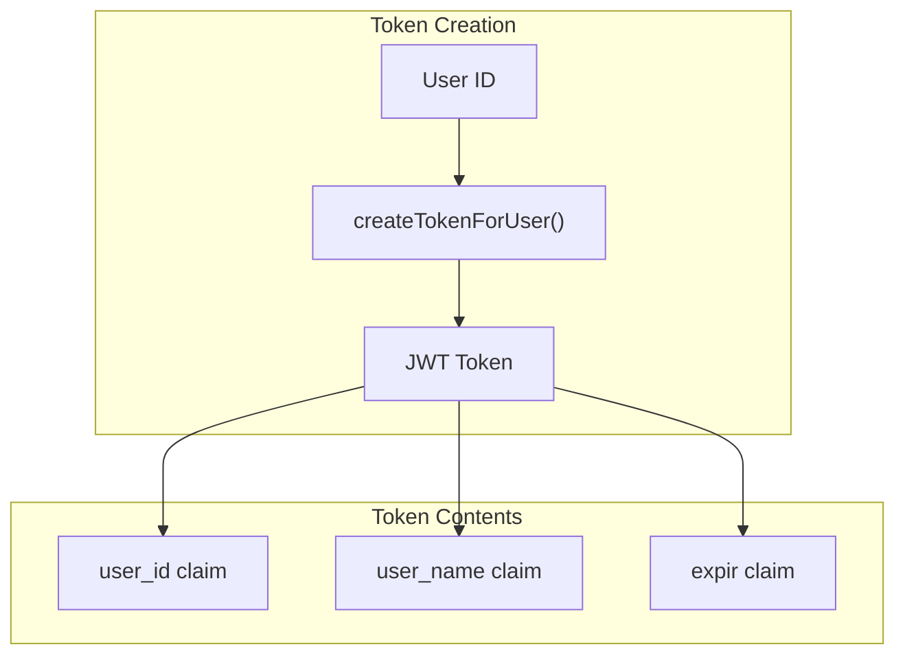
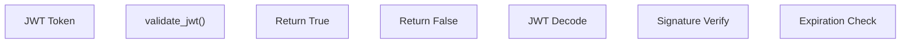
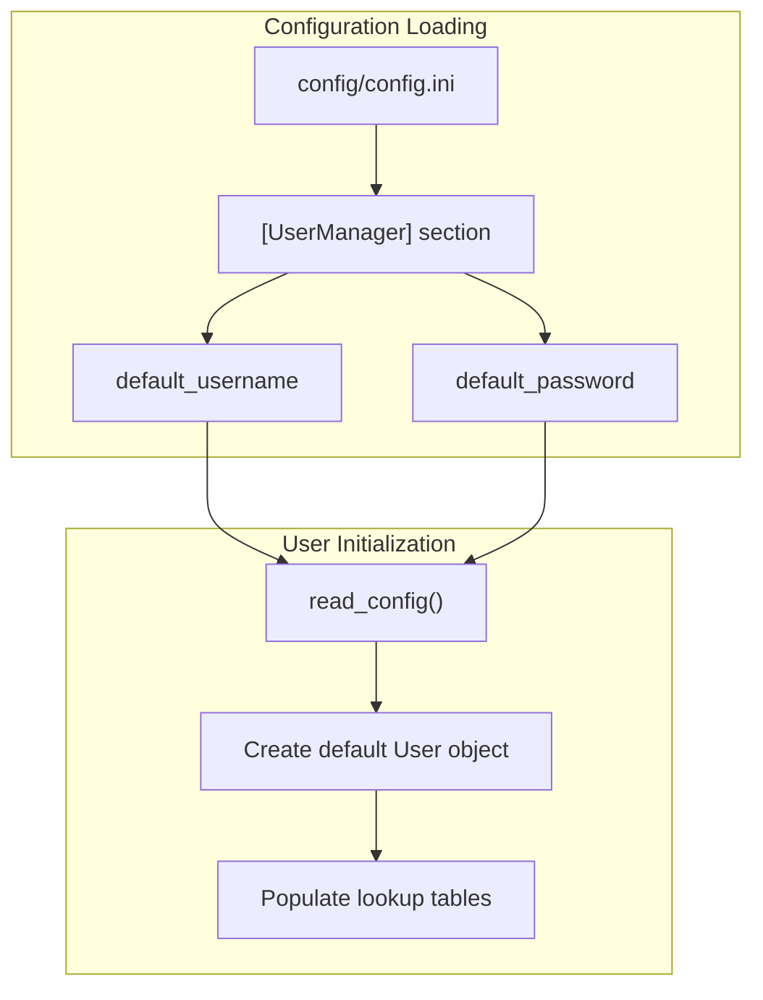

# User Management and Authentication

> **Relevant source files**
> * [openchecker/user_manager.py](https://github.com/Laniakea2012/openchecker/blob/00a9732e/openchecker/user_manager.py)
> * [test/test.py](https://github.com/Laniakea2012/openchecker/blob/00a9732e/test/test.py)
> * [test/test_token_operator.py](https://github.com/Laniakea2012/openchecker/blob/00a9732e/test/test_token_operator.py)
> * [test/test_user_manager.py](https://github.com/Laniakea2012/openchecker/blob/00a9732e/test/test_user_manager.py)

This document covers the user management and authentication systems in OpenChecker, including the in-memory user storage model, JWT-based authentication, and user lifecycle management operations. For information about the REST API endpoints that utilize this authentication system, see [REST API Endpoints](/Laniakea2012/openchecker/3.1-rest-api-endpoints).

## User Model and Storage Architecture

The OpenChecker system implements a simple in-memory user management system with JWT-based authentication. The core user model is defined in the `User` class and managed through a set of lookup tables for efficient access.

### User Data Model

The `User` class stores fundamental user information with a default access level of `['request']`. User IDs are generated using UUID5 with the DNS namespace and username as input, ensuring deterministic and unique identifiers.

Sources: [openchecker/user_manager.py L5-L13](https://github.com/Laniakea2012/openchecker/blob/00a9732e/openchecker/user_manager.py#L5-L13)

### Storage Implementation

The system maintains three data structures for efficient user lookup:

| Structure | Type | Purpose | Key |
| --- | --- | --- | --- |
| `userList` | list | Primary storage | Index-based |
| `usernameTable` | dict | Username lookup | `username` → `User` |
| `useridTable` | dict | User ID lookup | `user_id` → `User` |

Sources: [openchecker/user_manager.py L16-L18](https://github.com/Laniakea2012/openchecker/blob/00a9732e/openchecker/user_manager.py#L16-L18)

 [openchecker/user_manager.py L20-L36](https://github.com/Laniakea2012/openchecker/blob/00a9732e/openchecker/user_manager.py#L20-L36)

## User Management Operations

### User Creation and Registration

The `createUser` function adds new users to the system by generating a deterministic UUID5 identifier and updating all storage structures:

[ERROR_PROCESSING_ELEMENT: PRE]

Sources: [openchecker/user_manager.py L20-L21](https://github.com/Laniakea2012/openchecker/blob/00a9732e/openchecker/user_manager.py#L20-L21)

### User Lookup Functions

The system provides two primary lookup mechanisms:

* `indexUserWithID(userID)`: Direct lookup by user ID using `useridTable`
* `indexUserWithName(userName)`: Direct lookup by username using `usernameTable`

Both functions return `None` if the user is not found, providing safe access patterns for the authentication system.

Sources: [openchecker/user_manager.py L23-L27](https://github.com/Laniakea2012/openchecker/blob/00a9732e/openchecker/user_manager.py#L23-L27)

### User Lifecycle Management

The system supports complete user lifecycle operations:

| Operation | Function | Description |
| --- | --- | --- |
| Read | `get_all_users()` | Returns complete user list |
| Update | `update_user(userID, ...)` | Modifies user attributes |
| Delete | `delete_user(userID)` | Removes user and updates tables |

The `update_user` function handles partial updates and maintains consistency across all storage tables when username changes occur.

Sources: [openchecker/user_manager.py L38-L62](https://github.com/Laniakea2012/openchecker/blob/00a9732e/openchecker/user_manager.py#L38-L62)

## Authentication System

### Password-Based Authentication

The authentication system uses constant-time password comparison to prevent timing attacks:

The `authenticate` function uses `secrets.compare_digest()` for secure password comparison, encoding both stored and provided passwords as UTF-8 before comparison.

Sources: [openchecker/user_manager.py L29-L32](https://github.com/Laniakea2012/openchecker/blob/00a9732e/openchecker/user_manager.py#L29-L32)

### Identity Resolution

The `identity` function resolves JWT payload information back to user objects for request processing:

[ERROR_PROCESSING_ELEMENT: PRE]

Sources: [openchecker/user_manager.py L34-L36](https://github.com/Laniakea2012/openchecker/blob/00a9732e/openchecker/user_manager.py#L34-L36)

## JWT Token Management

### Token Creation

The JWT token system creates tokens containing user identification and expiration information. Based on the test structure, tokens include:

* `user_id`: User identifier for lookup
* `user_name`: Username for reference
* `expir`: Expiration timestamp as datetime object

Sources: [test/test_token_operator.py L20-L27](https://github.com/Laniakea2012/openchecker/blob/00a9732e/test/test_token_operator.py#L20-L27)

### Token Validation

The `validate_jwt` function provides boolean validation for token authenticity and expiration:

Sources: [test/test_token_operator.py L29-L44](https://github.com/Laniakea2012/openchecker/blob/00a9732e/test/test_token_operator.py#L29-L44)

## Configuration Management

### Default User Setup

The system initializes with a default user loaded from the configuration file:

The configuration is read using the `helper.read_config()` function, targeting the `UserManager` section of `config/config.ini`.

Sources: [openchecker/user_manager.py L15-L18](https://github.com/Laniakea2012/openchecker/blob/00a9732e/openchecker/user_manager.py#L15-L18)

## API Integration Example

### Authentication Endpoint Usage

The authentication system integrates with the REST API through the `/auth` endpoint:

[ERROR_PROCESSING_ELEMENT: PRE]

### Authenticated Request Flow

Once authenticated, clients use JWT tokens for subsequent requests:

[ERROR_PROCESSING_ELEMENT: PRE]

Sources: [test/test.py L10-L43](https://github.com/Laniakea2012/openchecker/blob/00a9732e/test/test.py#L10-L43)