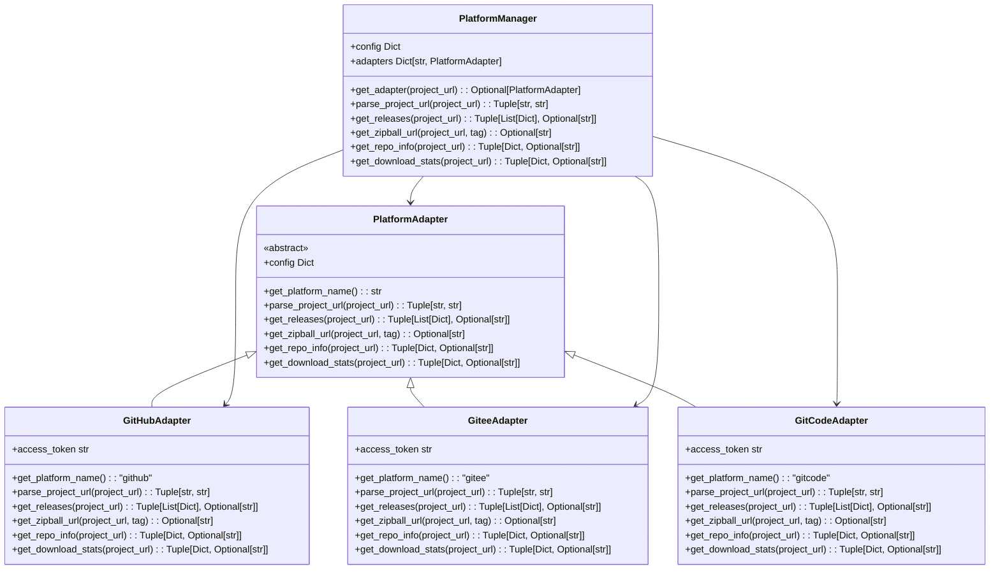
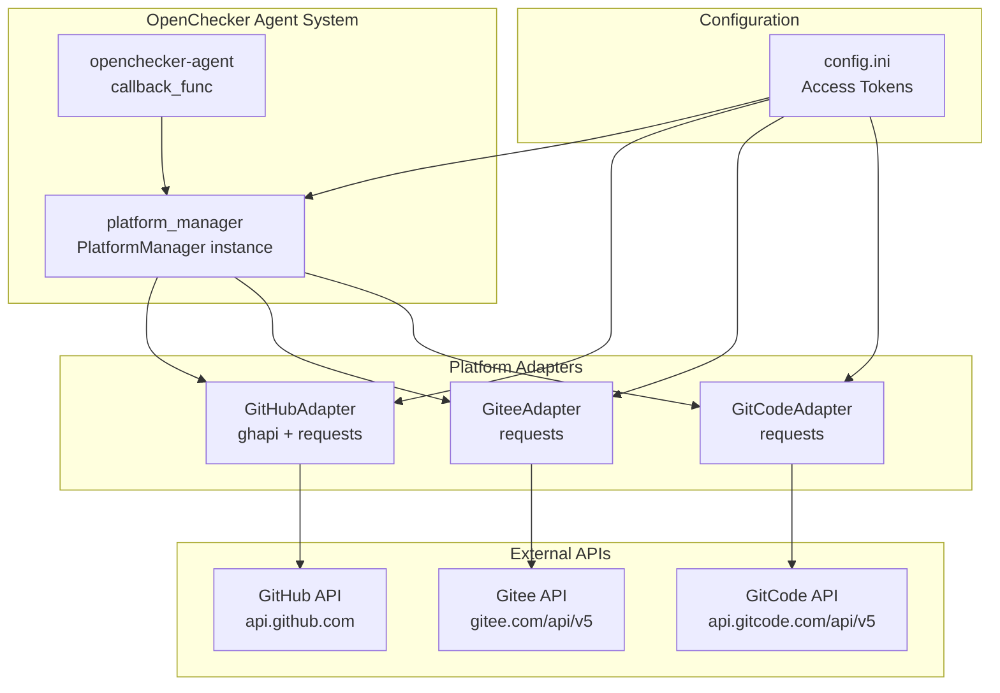

# Version Control Platform Adapters

> **Relevant source files**
> * [docs/platform-adapter.md](https://github.com/Laniakea2012/openchecker/blob/1dbd85d0/docs/platform-adapter.md)
> * [openchecker/platform_adapter.py](https://github.com/Laniakea2012/openchecker/blob/1dbd85d0/openchecker/platform_adapter.py)
> * [test/test_platform_adapter.py](https://github.com/Laniakea2012/openchecker/blob/1dbd85d0/test/test_platform_adapter.py)

## Purpose and Scope

The Version Control Platform Adapters provide a unified interface for interacting with different Git hosting platforms including GitHub, Gitee, and GitCode. This system abstracts platform-specific API differences through the adapter pattern, enabling consistent access to repository information, releases, and download statistics across multiple platforms.

For external service configuration details, see [External Service Configuration](/Laniakea2012/openchecker/5.2-external-service-configuration). For information about the broader platform integration architecture, see [Platform Integration and External Services](/Laniakea2012/openchecker/5-platform-integration-and-external-services).

## Architecture Overview

The platform adapter system uses the adapter pattern to provide a consistent interface across different version control platforms. The architecture consists of a base adapter class, platform-specific implementations, and a manager class that routes requests to the appropriate adapter.

**Platform Adapter Class Hierarchy**



Sources: [openchecker/platform_adapter.py L27-L96](https://github.com/Laniakea2012/openchecker/blob/1dbd85d0/openchecker/platform_adapter.py#L27-L96)

 [openchecker/platform_adapter.py L99-L174](https://github.com/Laniakea2012/openchecker/blob/1dbd85d0/openchecker/platform_adapter.py#L99-L174)

 [openchecker/platform_adapter.py L176-L250](https://github.com/Laniakea2012/openchecker/blob/1dbd85d0/openchecker/platform_adapter.py#L176-L250)

 [openchecker/platform_adapter.py L252-L351](https://github.com/Laniakea2012/openchecker/blob/1dbd85d0/openchecker/platform_adapter.py#L252-L351)

 [openchecker/platform_adapter.py L353-L463](https://github.com/Laniakea2012/openchecker/blob/1dbd85d0/openchecker/platform_adapter.py#L353-L463)

## Supported Platforms

The system supports three major version control platforms, each with platform-specific implementations that handle API differences and URL formats.

### Platform Comparison

| Platform | Base Class | URL Pattern | API Base | Download Stats Support |
| --- | --- | --- | --- | --- |
| GitHub | `GitHubAdapter` | `github.com` | `api.github.com` | No |
| Gitee | `GiteeAdapter` | `gitee.com` | `gitee.com/api/v5` | No |
| GitCode | `GitCodeAdapter` | `gitcode.com` | `api.gitcode.com/api/v5` | Yes |

### GitHub Implementation

The `GitHubAdapter` uses the GitHub API v4 through the `ghapi` library for releases and direct REST API calls for repository information. It supports both authenticated and unauthenticated requests, with authentication providing higher rate limits.

**Key Methods:**

* `parse_project_url()` supports GitHub URL variations with and without `.git` suffix
* `get_releases()` uses `ghapi.paged()` for paginated results
* `get_zipball_url()` constructs download URLs using GitHub's archive format
* `get_repo_info()` retrieves homepage and description via REST API

Sources: [openchecker/platform_adapter.py L99-L174](https://github.com/Laniakea2012/openchecker/blob/1dbd85d0/openchecker/platform_adapter.py#L99-L174)

### Gitee Implementation

The `GiteeAdapter` interfaces with Gitee's REST API v5, requiring access tokens for most operations. It follows similar patterns to GitHub but uses Gitee-specific API endpoints and URL formats.

**Key Methods:**

* `parse_project_url()` handles Gitee-specific URL patterns
* `get_releases()` calls `/repos/{owner}/{repo}/releases` endpoint
* `get_zipball_url()` uses Gitee's repository archive format
* `get_repo_info()` requires access token in query parameters

Sources: [openchecker/platform_adapter.py L176-L250](https://github.com/Laniakea2012/openchecker/blob/1dbd85d0/openchecker/platform_adapter.py#L176-L250)

### GitCode Implementation

The `GitCodeAdapter` supports CSDN's GitCode platform with additional functionality including download statistics. It uses similar API patterns to Gitee but with GitCode-specific endpoints.

**Key Methods:**

* `parse_project_url()` handles GitCode URL patterns
* `get_releases()` accesses releases via `/api/v5/repos/{owner}/{repo}/releases`
* `get_download_stats()` provides unique download analytics via `/download_statistics` endpoint
* `get_zipball_url()` uses `raw.gitcode.com` domain for archive downloads

Sources: [openchecker/platform_adapter.py L252-L351](https://github.com/Laniakea2012/openchecker/blob/1dbd85d0/openchecker/platform_adapter.py#L252-L351)

## Unified Interface Through PlatformManager

The `PlatformManager` class provides a unified interface that automatically routes requests to the appropriate platform adapter based on URL analysis. This abstraction layer eliminates the need for calling code to handle platform-specific logic.

**Platform Routing and Method Delegation**

```mermaid
sequenceDiagram
  participant Client Code
  participant PlatformManager
  participant get_adapter()
  participant Platform Adapter
  participant Platform API

  Client Code->>PlatformManager: "get_releases(project_url)"
  PlatformManager->>get_adapter(): "get_adapter(project_url)"
  get_adapter()->>get_adapter(): "URL analysis"
  note over get_adapter(): "github.com → GitHubAdapter"
  get_adapter()-->>PlatformManager: "adapter instance"
  PlatformManager->>Platform Adapter: "get_releases(project_url)"
  Platform Adapter->>Platform Adapter: "parse_project_url()"
  Platform Adapter->>Platform API: "HTTP request"
  Platform API-->>Platform Adapter: "JSON response"
  Platform Adapter-->>PlatformManager: "(releases, error)"
  PlatformManager-->>Client Code: "(releases, error)"
```

### Platform Detection Logic

The `PlatformManager.get_adapter()` method uses simple string matching to determine the appropriate adapter:

* URLs containing `"github.com"` → `GitHubAdapter`
* URLs containing `"gitee.com"` → `GiteeAdapter`
* URLs containing `"gitcode.com"` → `GitCodeAdapter`
* Other URLs → `None`

### Error Handling Pattern

All platform adapter methods follow a consistent error handling pattern, returning tuples of `(result, error)` where:

* Success: `(data, None)`
* Failure: `(empty_result, error_message)`

Common error types include:

* `"Unsupported platform"` - Platform not recognized
* `"Repository not found"` - Invalid repository or access denied
* `"Token limit exceeded"` - API rate limit reached
* Network errors and malformed responses

Sources: [openchecker/platform_adapter.py L353-L463](https://github.com/Laniakea2012/openchecker/blob/1dbd85d0/openchecker/platform_adapter.py#L353-L463)

## Configuration Requirements

The platform adapters require access tokens configured in the system configuration file. Each platform section must include an `access_key` parameter for API authentication.

### Configuration Structure

```
[Github]
access_key = ghp_xxxxxxxxxxxxxxxxxxxx

[Gitee]  
access_key = xxxxxxxxxxxxxxxxxxxxxxxx

[GitCode]
access_key = xxxxxxxxxxxxxxxxxxxxxxxx
```

The configuration is loaded through the `helper.read_config()` function and passed to adapter constructors. The global `platform_manager` instance is initialized with this configuration at module import time.

Sources: [openchecker/platform_adapter.py L20-L25](https://github.com/Laniakea2012/openchecker/blob/1dbd85d0/openchecker/platform_adapter.py#L20-L25)

 [openchecker/platform_adapter.py L465-L466](https://github.com/Laniakea2012/openchecker/blob/1dbd85d0/openchecker/platform_adapter.py#L465-L466)

## URL Parsing and Validation

Each adapter implements platform-specific URL parsing using regular expressions to extract owner and repository names from various URL formats.

### Supported URL Formats

**GitHub URLs:**

* `https://github.com/owner/repo`
* `https://github.com/owner/repo.git`
* `https://www.github.com/owner/repo`

**Gitee URLs:**

* `https://gitee.com/owner/repo`
* `https://gitee.com/owner/repo.git`
* `https://www.gitee.com/owner/repo`

**GitCode URLs:**

* `https://gitcode.com/owner/repo`
* `https://gitcode.com/owner/repo.git`
* `https://www.gitcode.com/owner/repo`

### Parsing Implementation

Each adapter uses similar regex patterns with platform-specific domains:

```
pattern = r"https://(?:www\.)?{domain}\.com/([^/]+)/([^/]+?)(?:\.git)?$"
```

Invalid URLs raise `ValueError` exceptions with descriptive error messages.

Sources: [openchecker/platform_adapter.py L109-L121](https://github.com/Laniakea2012/openchecker/blob/1dbd85d0/openchecker/platform_adapter.py#L109-L121)

 [openchecker/platform_adapter.py L186-L198](https://github.com/Laniakea2012/openchecker/blob/1dbd85d0/openchecker/platform_adapter.py#L186-L198)

 [openchecker/platform_adapter.py L262-L274](https://github.com/Laniakea2012/openchecker/blob/1dbd85d0/openchecker/platform_adapter.py#L262-L274)

## Integration with Analysis System

The platform adapters integrate with the broader OpenChecker system through the global `platform_manager` instance, which is imported and used by the analysis agents for retrieving repository metadata and release information.

**System Integration Flow**



The platform adapters provide essential metadata for project analysis including:

* Release version information for vulnerability scanning
* Repository descriptions for project classification
* Download statistics for popularity metrics
* Source code archive URLs for local analysis

Sources: [openchecker/platform_adapter.py L465-L466](https://github.com/Laniakea2012/openchecker/blob/1dbd85d0/openchecker/platform_adapter.py#L465-L466)

 [docs/platform-adapter.md L1-L246](https://github.com/Laniakea2012/openchecker/blob/1dbd85d0/docs/platform-adapter.md#L1-L246)